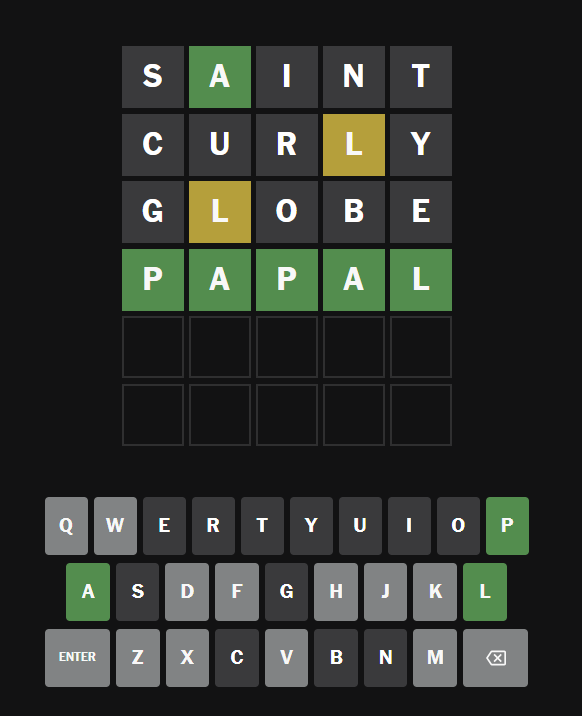

# Wordle Hacker

## About Project

***

### What Is The Wordle?

It's a web game which gives a 5-letter word a day, and you have only 6 tries to guess it.
After your try, every letter is designed by one of 3 colors. They are green, yellow and gray.
Green letter means that you hit the bull's-eye.
Yellow one means that this letter is in the word, but not exactly in this position.
And gray one means it's not in the word.
It's so easy rules.

### What Does Script Do?

Here you can easily guess the word using commands in your console.
Just [run it](README.md#how-to-run) and input help there to see
```text
update - command to update green, yellow gray letters
Form: update [word][gn (green), y (yellow), or gy (gray)]\n
Usage: (saint) > update sgy agn iy ngy tgy

new game - reset states of letters
Form: new game
Usage: new game
```



### How Did I Get to This?

I had created a bot before but for the Russian analog of the Wordle.
But that script has already been lost, and besides, the bot for an English Wordle will be much more useful.
So I decided to remake it.

### Math

We have 26 letters in alphabet.
So we have $$26! / (26-5)! = 7.8936 * 10^6$$ combinations of it.
But only about 171,476 are real words.
Where I got list of words, there are 12,986.
And only 2,309 uses in Wordle.
For curious, to guess by first try is $$\frac{1}{2 309} ≈ 0.0433\%$$

Some letters use more often, than others.
Some letters are more often in some word position, than others.
Some letters often use in group, like `-ic` (topic, tonic, antic, attic, basic ...), `-ty` (booty, aunty, deity ...) and so on.

So if we had tried, for example, `cumin` and had <span style="color:green;">green</span> `i` and <span style="color:yellow;">yellow</span> `c`, then it would have more likely been some word which ends in `-ic`.
But our script thinks differently.

We have a database in which we know every green, yellow and gray letters.
There are dictionary in which key stands for position and as a value is letter for green, for yellow the same one but as a value is an array of letters.

Considering how many times every letter in each position we can find, and having gotten green, yellow and gray letters from database we can count chances for each letter.

When we check some word, we will figure out a states of its letters.
- If it's <span style="color:gray;">gray</span>, then it's $$0\%$$ chance to find this letter in any position.
But in the code, I wrote that number of detections is 0 for this letter in each position.
- If it's <span style="color:yellow;">yellow</span>, then it's $$0\%$$ chance to find this letter in currently position.
But actually, I wrote that number of detections is just 0 for current position for this letter.
- And if it's <span style="color:green;">green</span>, then it's $$100\%$$ to find out this letter in current position, but it's not a proof that we cannot find out it in other position.
And conversely, chance to find out other letters in current position is 0.
And in the code I wrote like the same but script just assigns that number of the detections of green letter is 1 for others is 0, summary nothing changes.

But we have to understand that if we have not enough information to guess the word,
then we won't be able to use this information to exactly guess,
but we should use it effectively, so try such word which helps to reduce a selection.

To get more information we should take unknown letters, except green letters and don't let yellow ones into greens' places.

### Future Updates

I want to make web app in Telegram to not only guess the words but play the Wordle when you want.

<br>

## How to run

***

1. Update dictionary.json using [dictionary.py](data/dictionary.py)

```shell
cd data
python dictionary.py
```

2. Just run [main.py](main.py)

```shell
python main.py
```

<br>
